# Avaliação — Engenharia de Software

Aluno: Yasmin Alves da Silva
RA: 25000193
Data: 25/03/2026

---

# 1. Definição do MVP

Meu MVP cobre o processo de venda desde a identificação/cadastro do cliente até a emissão do comprovante, incluindo verificação de estoque, tratamento de estoque insuficiente e registro de venda a prazo em contas a receber.

- O que está **dentro** do MVP: cadastro e identificação de clientes, consulta e cadastro de produtos, realização de venda (à vista e a prazo), verificação e atualização de estoque, emissão de comprovante, registro em contas a receber e alertas de estoque mínimo.

- O que está **fora** do MVP: módulo de compras e fornecedores, contas a pagar, relatórios gerenciais, transferência entre unidades e gestão de usuários/permissões.

- Por que essas escolhas: o fluxo de venda é o processo central da farmácia. Sem ele funcionando corretamente, os demais módulos não têm utilidade imediata. Compras, financeiro e relatórios entram numa segunda fase.

---

# 2. Regras de Negócio (mínimo: 5)

**RN01 —** Produto sem estoque disponível na unidade não pode ser vendido.

**RN02 —** Medicamentos controlados exigem receita médica válida, validada pelo farmacêutico antes de concluir a venda.

**RN03 —** Venda a prazo só pode ser feita para clientes cadastrados no sistema. Clientes sem cadastro só compram à vista.

**RN04 —** Quando o estoque de um produto ficar abaixo do nível mínimo definido, o sistema deve emitir alerta ao gerente.

**RN05 —** O estoque deve ser atualizado automaticamente após qualquer venda — nunca de forma manual pelo atendente.

**RN06 —** O preço de venda exibido é sempre o preço atual cadastrado no sistema; descontos só podem ser aplicados por gerentes.

**RN07 —** Toda venda a prazo gera automaticamente um registro em contas a receber com status "Aberta" e data de vencimento definida.

---

# 3. Requisitos Funcionais (mínimo: 8)

**RF01 —** O sistema deve permitir buscar produtos por nome, código de barras ou fabricante.

**RF02 —** O sistema deve verificar a disponibilidade de estoque da unidade antes de confirmar qualquer item da venda.

**RF03 —** O sistema deve permitir cadastrar e identificar clientes durante o atendimento.

**RF04 —** O sistema deve registrar vendas com itens, quantidades, valores e forma de pagamento.

**RF05 —** O sistema deve emitir um comprovante ao final de cada venda.

**RF06 —** O sistema deve atualizar o estoque automaticamente após a conclusão de uma venda.

**RF07 —** O sistema deve registrar vendas a prazo em contas a receber, com valor, vencimento e status.

**RF08 —** O sistema deve emitir alerta quando um produto atingir o estoque mínimo.

**RF09 —** O sistema deve permitir que o farmacêutico valide receitas médicas para produtos controlados.

**RF10 —** O sistema deve permitir que gerentes cadastrem e editem produtos e ajustem preços.

---

# 🛡 4. Requisitos Não Funcionais (mínimo: 4)

**RNF01 —** O sistema deve responder às consultas de produto em no máximo 2 segundos.

**RNF02 —** O acesso deve ser autenticado por login e senha, com controle de permissões por perfil de usuário.

**RNF03 —** O sistema deve estar disponível durante todo o horário de funcionamento das unidades, com no máximo 1 hora de indisponibilidade mensal.

**RNF04 —** Os dados financeiros e de clientes devem ser armazenados com segurança, com backup diário automático.

**RNF05 —** A interface deve ser simples o suficiente para que um atendente opere sem treinamento técnico específico.

---

# 5. Casos de Uso (mínimo: 10)

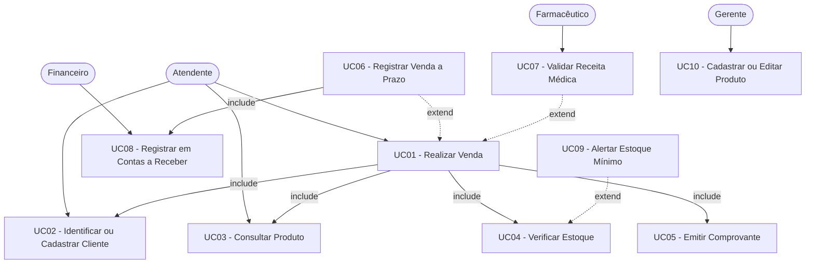

**Includes:** UC01 inclui UC02, UC03, UC04 e UC05 (toda venda passa por esses passos obrigatoriamente). UC06 inclui UC08 (toda venda a prazo gera lançamento financeiro).

**Extends:** UC06 estende UC01 (só ocorre quando o pagamento é a prazo). UC07 estende UC01 (só quando o produto é controlado). UC09 estende UC04 (só quando o estoque atinge o nível mínimo).

---

# 6. Documentação dos Casos de Uso

---

## **UC01 — Realizar Venda**

**Ator(es):** Atendente
**Descrição:** Processo completo de registrar uma venda no balcão, da identificação do cliente até a emissão do comprovante.
**Pré-condições:** Atendente autenticado no sistema.
**Pós-condições:** Venda registrada, estoque atualizado e comprovante emitido.

### Fluxo Principal
1. Atendente identifica o cliente (UC02).
2. Atendente busca o produto desejado (UC03).
3. Sistema verifica disponibilidade no estoque (UC04).
4. Atendente informa a quantidade e confirma o item.
5. Atendente repete os passos 2 a 4 para outros produtos.
6. Atendente seleciona a forma de pagamento e finaliza a venda.
7. Sistema emite o comprovante (UC05).

### Fluxos Alternativos / Exceções
- FA01 — Estoque insuficiente: sistema bloqueia o item e informa o atendente com a quantidade disponível. Atendente pode ajustar a quantidade ou remover o item.
- FA02 — Produto não encontrado: sistema exibe mensagem e permite nova busca.
- FA03 — Pagamento a prazo: sistema aciona UC06 para registrar em contas a receber.
- FA04 — Produto controlado: sistema sinaliza e aciona UC07 para validação da receita antes de liberar o item.

### Relacionamentos
- **Include:** UC02 (identificar cliente), UC03 (consultar produto), UC04 (verificar estoque), UC05 (emitir comprovante)
- **Extend:** UC06 (venda a prazo), UC07 (produto controlado)

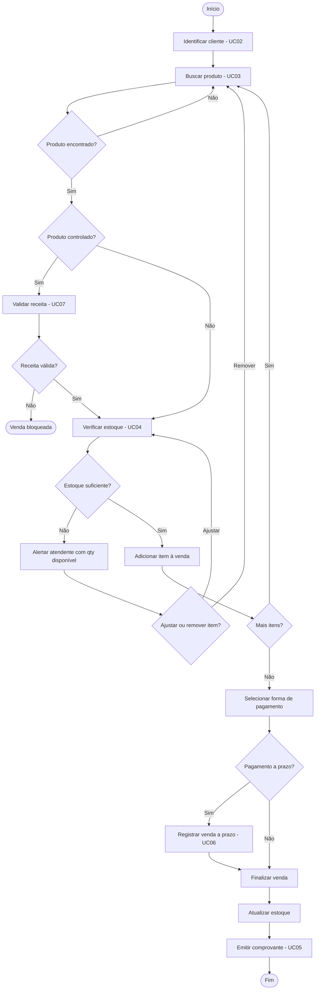

---

## **UC02 — Identificar/Cadastrar Cliente**

**Ator(es):** Atendente
**Descrição:** Buscar o cliente no sistema ou cadastrá-lo rapidamente quando não está registrado.
**Pré-condições:** Atendente autenticado.
**Pós-condições:** Cliente identificado e vinculado à venda em andamento.

### Fluxo Principal
1. Atendente busca o cliente por nome, CPF ou telefone.
2. Sistema exibe os dados do cliente encontrado.
3. Atendente confirma o cliente para vincular à venda.

### Fluxos Alternativos / Exceções
- FA01 — Cliente não cadastrado e venda à vista: atendente pode prosseguir sem identificação.
- FA02 — Cliente não cadastrado e venda a prazo: sistema impede e exige o cadastro. Atendente realiza cadastro rápido com nome e CPF.

### Relacionamentos
- **Include:** (não aplicável)
- **Extend:** (não aplicável)

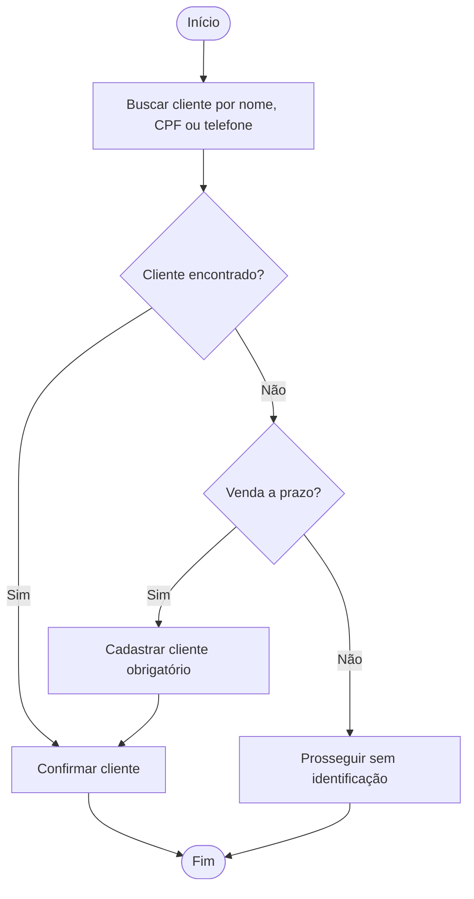

---

## **UC03 — Consultar Produto**

**Ator(es):** Atendente
**Descrição:** Buscar um produto pelo nome, código de barras ou fabricante para incluir na venda.
**Pré-condições:** Atendente autenticado.
**Pós-condições:** Produto localizado com preço e informações exibidos.

### Fluxo Principal
1. Atendente digita o critério de busca.
2. Sistema retorna os produtos correspondentes.
3. Atendente seleciona o produto desejado.
4. Sistema exibe descrição, preço e fabricante.

### Fluxos Alternativos / Exceções
- FA01 — Nenhum produto encontrado: sistema exibe mensagem e permite nova tentativa.
- FA02 — Múltiplos resultados: sistema exibe lista para o atendente selecionar.

### Relacionamentos
- **Include:** (não aplicável)
- **Extend:** (não aplicável)

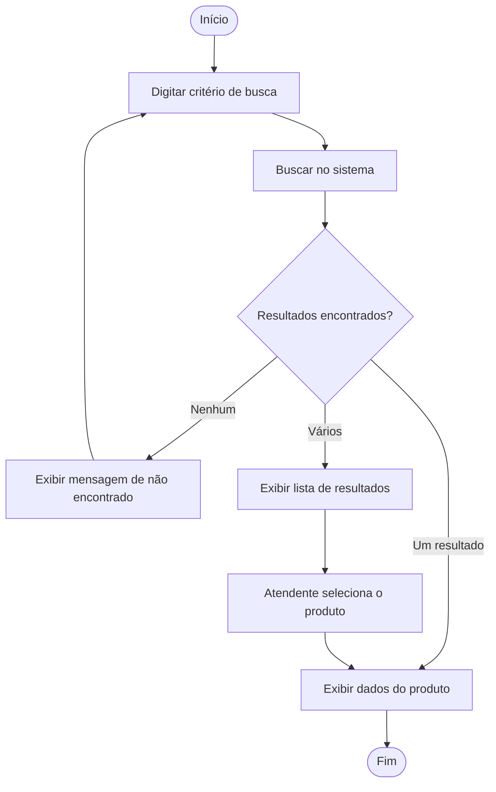

---

## **UC04 — Verificar Estoque**

**Ator(es):** Sistema
**Descrição:** Verificar se há quantidade suficiente do produto na unidade antes de adicioná-lo à venda.
**Pré-condições:** Produto selecionado e quantidade informada.
**Pós-condições:** Estoque confirmado e item liberado, ou venda bloqueada para o item.

### Fluxo Principal
1. Sistema consulta o estoque atual do produto na unidade.
2. Sistema compara com a quantidade solicitada.
3. Se suficiente, libera o item para a venda.

### Fluxos Alternativos / Exceções
- FA01 — Estoque insuficiente: sistema bloqueia o item e informa o atendente com a quantidade disponível.
- FA02 — Estoque abaixo do mínimo após a venda: sistema aciona UC09 para emitir alerta ao gerente.

### Relacionamentos
- **Include:** (não aplicável)
- **Extend:** UC09 (quando estoque atinge nível mínimo)

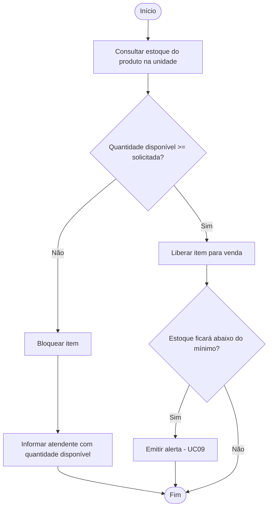

---

## **UC05 — Emitir Comprovante**

**Ator(es):** Sistema
**Descrição:** Gerar e disponibilizar o comprovante com todos os detalhes da venda finalizada.
**Pré-condições:** Venda concluída e registrada no sistema.
**Pós-condições:** Comprovante gerado e disponível para impressão.

### Fluxo Principal
1. Sistema compila os dados da venda (itens, quantidades, valores e forma de pagamento).
2. Sistema gera o comprovante.
3. Comprovante é exibido na tela e disponibilizado para impressão.

### Fluxos Alternativos / Exceções
- FA01 — Impressora indisponível: sistema exibe aviso e mantém o comprovante disponível para reimpressão posterior.

### Relacionamentos
- **Include:** (não aplicável)
- **Extend:** (não aplicável)

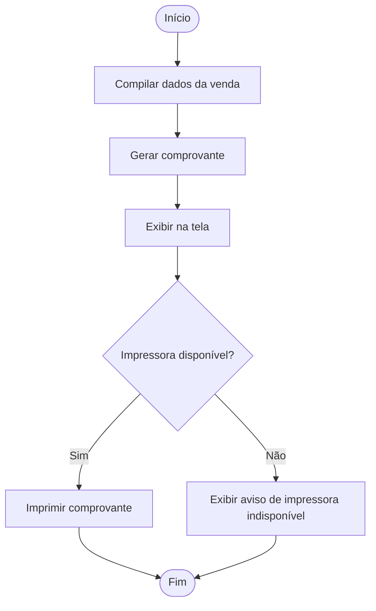

---

## **UC06 — Registrar Venda a Prazo**

**Ator(es):** Atendente
**Descrição:** Extensão da venda comum para tratar o parcelamento quando o cliente opta por pagamento a prazo.
**Pré-condições:** Cliente cadastrado e identificado; venda em andamento.
**Pós-condições:** Venda registrada como a prazo; lançamento criado em contas a receber.

### Fluxo Principal
1. Atendente seleciona a opção de pagamento a prazo.
2. Atendente define a data de vencimento.
3. Sistema registra a venda com a condição a prazo.
4. Sistema aciona o registro em contas a receber (UC08).

### Fluxos Alternativos / Exceções
- FA01 — Cliente sem cadastro: sistema bloqueia a operação e redireciona para o cadastro do cliente.

### Relacionamentos
- **Include:** UC08 (registrar em contas a receber)
- **Extend:** estende UC01

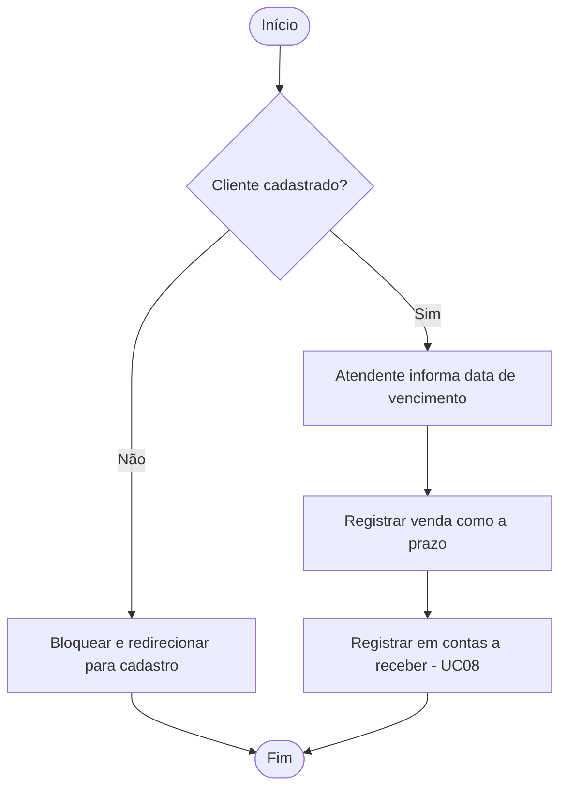

---

## **UC07 — Validar Receita Médica**

**Ator(es):** Farmacêutico
**Descrição:** Verificar e registrar a receita médica antes de liberar a venda de produto controlado.
**Pré-condições:** Produto identificado como controlado; cliente identificado.
**Pós-condições:** Receita validada e produto liberado, ou venda bloqueada para o item.

### Fluxo Principal
1. Sistema identifica que o produto é controlado e sinaliza ao atendente.
2. Atendente solicita a receita ao cliente e chama o farmacêutico.
3. Farmacêutico analisa a receita.
4. Farmacêutico registra a validação no sistema.
5. Sistema libera o produto para inclusão na venda.

### Fluxos Alternativos / Exceções
- FA01 — Receita inválida ou ausente: farmacêutico rejeita e sistema bloqueia o produto na venda.
- FA02 — Receita vencida: tratamento igual ao FA01.

### Relacionamentos
- **Include:** (não aplicável)
- **Extend:** estende UC01

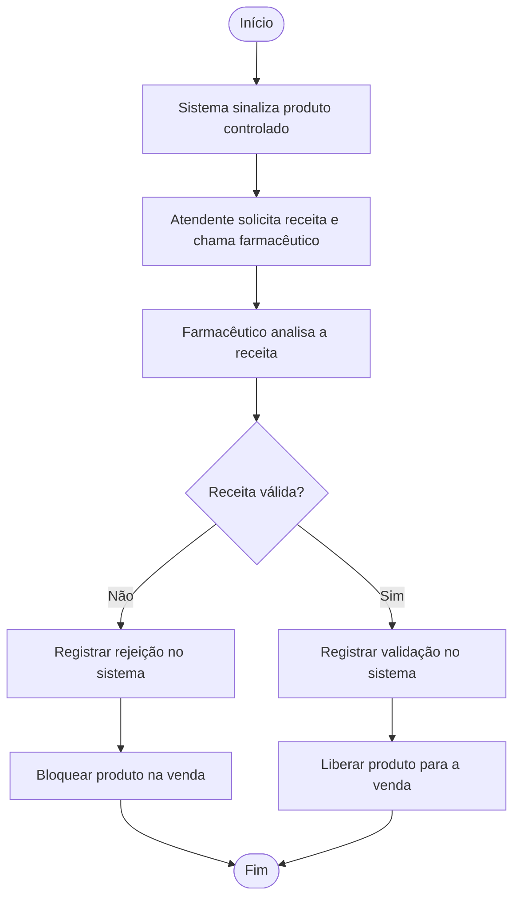

---

## **UC08 — Registrar em Contas a Receber**

**Ator(es):** Sistema, Financeiro
**Descrição:** Criar o lançamento financeiro para acompanhamento de venda realizada a prazo.
**Pré-condições:** Venda a prazo confirmada com data de vencimento definida.
**Pós-condições:** Lançamento criado com status "Aberta" e disponível para o setor financeiro.

### Fluxo Principal
1. Sistema coleta os dados da venda a prazo (valor, cliente, vencimento).
2. Sistema cria o lançamento com status "Aberta".
3. Lançamento fica disponível para consulta e controle pelo setor financeiro.

### Fluxos Alternativos / Exceções
- FA01 — Erro ao criar o lançamento: sistema exibe aviso e tenta novamente. Se falhar novamente, registra log para revisão manual.

### Relacionamentos
- **Include:** (não aplicável)
- **Extend:** (não aplicável)

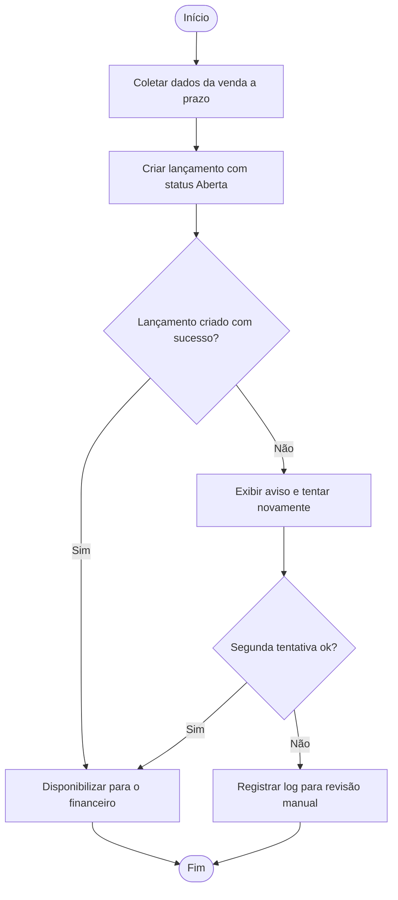

---

## **UC09 — Alertar Estoque Mínimo**

**Ator(es):** Sistema, Gerente
**Descrição:** Emitir alerta quando o estoque de um produto atingir o nível mínimo configurado.
**Pré-condições:** Nível mínimo definido para o produto; verificação de estoque executada (UC04).
**Pós-condições:** Gerente notificado e alerta registrado no painel de avisos.

### Fluxo Principal
1. Sistema detecta que o estoque atingiu ou ficou abaixo do nível mínimo.
2. Sistema gera o alerta.
3. Sistema notifica o gerente da unidade.
4. Alerta fica registrado no painel de avisos.

### Fluxos Alternativos / Exceções
- FA01 — Nível mínimo não configurado para o produto: sistema não emite alerta por falta de parâmetro de comparação.

### Relacionamentos
- **Include:** (não aplicável)
- **Extend:** estende UC04

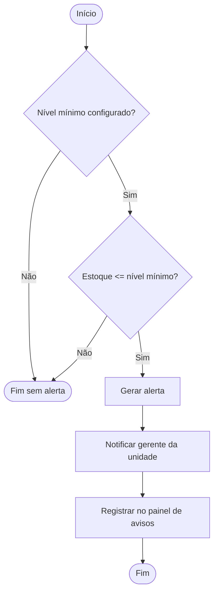

---

## **UC10 — Cadastrar/Editar Produto**

**Ator(es):** Gerente
**Descrição:** Incluir novos produtos ou atualizar informações de produtos existentes no catálogo do sistema.
**Pré-condições:** Gerente autenticado no sistema.
**Pós-condições:** Produto cadastrado ou atualizado com sucesso.

### Fluxo Principal
1. Gerente acessa o módulo de produtos.
2. Gerente preenche ou edita: descrição, preço, unidade de medida, fabricante e estoque mínimo.
3. Sistema valida os dados informados.
4. Sistema salva as alterações.

### Fluxos Alternativos / Exceções
- FA01 — Dados obrigatórios ausentes: sistema destaca os campos e impede o salvamento.
- FA02 — Código de barras duplicado: sistema exibe aviso e não permite o cadastro.

### Relacionamentos
- **Include:** (não aplicável)
- **Extend:** (não aplicável)

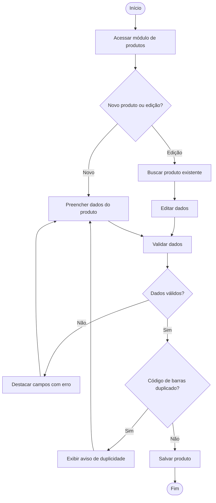
